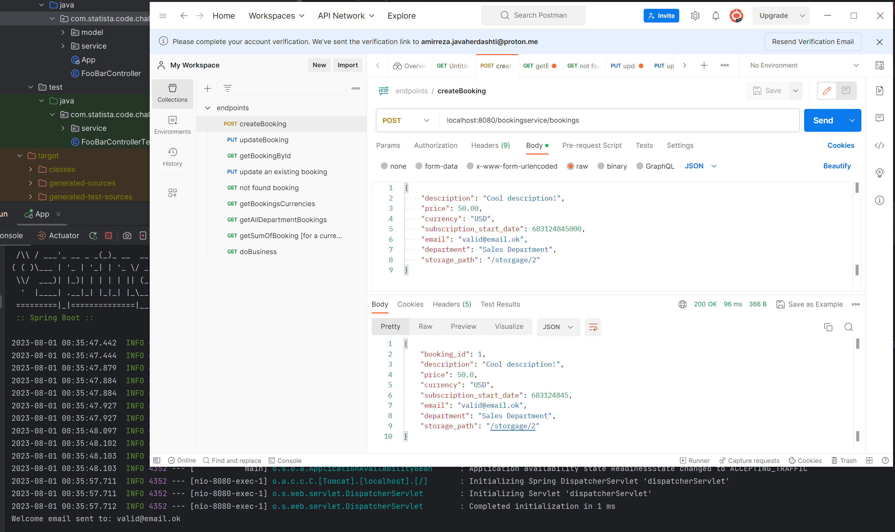
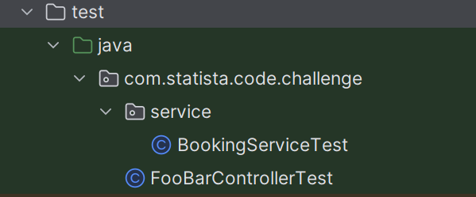

## Hi

This project serves as a sample implementation of a RESTful web service capable of storing booking objects in memory and providing information about them.

### How to?

To get started, clone this project and ensure that the required dependencies are installed (JDK 8 is necessary). Then, execute the App.java file.

### Postman collection:

You can access the postman collection including all endpoints [here](endpoints.postman_collection.json).
You can use this collection to interact with the web service effortlessly.

### Where are the tests located?

In `code-challenge/` directory under `/src/test`

### The endpoints are:

POST /bookingservice/bookings

PUT /bookingservice/bookings/{booking_id}

GET /bookingservice/bookings/{booking_id}

GET /bookingservice/bookings/department/{department}

GET /bookingservice/bookings/currencies

GET /bookingservice/sum/{currency}

GET /bookingservice/bookings/dobusiness/{booking_id}